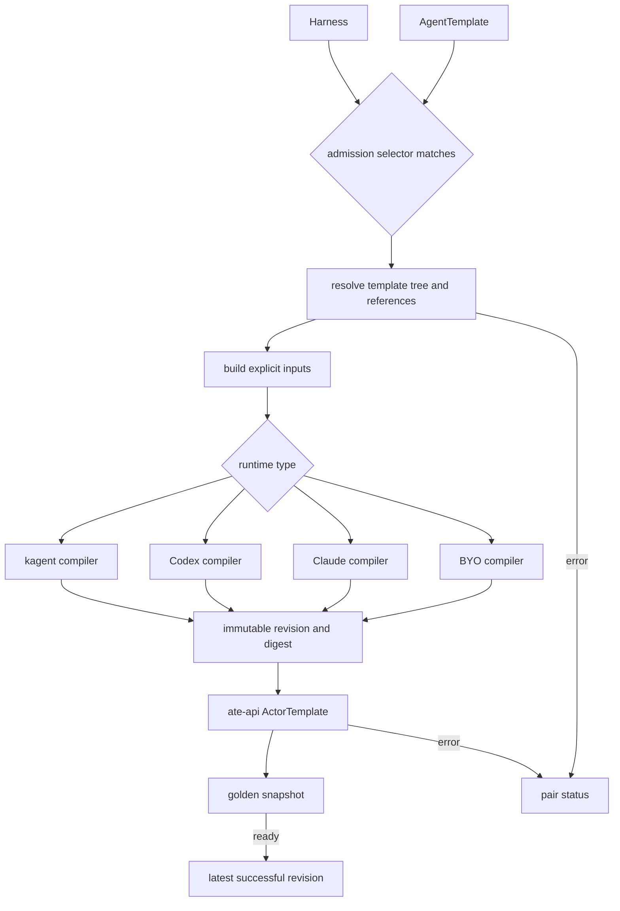

# Configuration and Compilation

## Public configuration

`Harness` describes how to run a class of agents. It selects exactly one runtime
variant—kagent, Codex, Claude, or BYO—and contains workload image/command/args,
environment and credential references, WorkerPool configuration, snapshot
location, and an admission selector.

`AgentTemplate` describes what the agent does. It contains model configuration,
description and prompt, MCP tool bindings, skills, plugins, and Shared or
Dedicated agent bindings. Model configuration may be omitted for BYO images;
pair compilation rejects managed harness combinations without one.

Both are `kagent.dev/v1alpha3` Kubernetes resources. Infrastructure-derived
values such as runtime addresses and inferred egress do not belong in the public
API.

### Actor container capabilities

Every harness type may adjust the Linux capabilities of its runtime container
through `spec.workload.securityContext.capabilities`. Names omit the `CAP_`
prefix, as Substrate's ActorTemplate API does; `drop` applies before `add`, and
`ALL` is accepted only in `drop`:

```yaml
spec:
  workload:
    image: example.com/agent@sha256:...
    securityContext:
      capabilities:
        add: ["SETFCAP"]
```

The compiler carries the adjustment into the revision, where it participates in
revision identity (a Harness that never mentions a security context keeps its
existing digest byte-for-byte), and the generated ActorTemplate sets the
container's `securityContext`. Substrate resolves the effective set as its default
(`AUDIT_WRITE`, `KILL`, `NET_BIND_SERVICE`) minus `drop` plus `add`.

Additions are gated by the controller's operator. The controller honors only
capabilities listed in `SUBSTRATE_ALLOWED_ACTOR_CAPABILITIES` (Helm:
`controller.substrate.allowedActorCapabilities`), which is empty by default. A
Harness requesting anything else reports `Compatible=False` with reason
`CapabilityNotAllowed`, names the refused capability, and produces no desired
ActorTemplate. Drops need no allowance: removing a default capability never
widens the sandbox.

The adjustment changes the process inside the sandbox only. It does not change
the sandbox class, the worker pod's own security context, or anything on the
host; the sandbox kernel enforces the capability. Use it for runtimes that need
to create user namespaces or switch uids for their own child processes, and keep
the allowlist to what those runtimes actually need.

## Prepared revision pipeline

The v2 controller collects admitted Harness/AgentTemplate pairs and compiles each
pair through one pipeline:



1. Resolve the template tree and referenced Kubernetes objects.
2. Build explicit, harness-independent inputs.
3. Select the harness compiler from the runtime-type registration map.
4. Produce an immutable revision containing workload, configuration, Agent Card,
   capacity, snapshot, provenance, and inferred egress inputs.
5. Hash the revision and apply it as an ate-api ActorTemplate.
6. Wait for the golden snapshot to become ready.
7. Persist the revision and advance the pair's latest-successful pointer.

A failed compile or apply leaves the previous successful revision available.
AgentInstances pin a prepared revision, so later template edits do not mutate a
running instance.

Harness compilers only translate inputs. The controller and Substrate adapter own
application and readiness. The central entry points are
[`translator/compiler.go`](../../go/core/internal/translator/compiler.go) and
[`controller/reconciler.go`](../../go/core/internal/controller/reconciler.go).

## Harness-specific output

- **kagent** emits Go ADK configuration, the Harness's memory and context
  compaction policy, Shared native subagents, and the kagent HITL extension.
- **Codex** emits native App Server configuration, OpenAI or Bedrock model setup,
  Streamable HTTP MCP servers, Shared agents, and skills. Approvals are currently
  disabled by policy.
- **Claude** emits Anthropic, Bedrock, or Vertex model setup, HTTP/SSE MCP
  servers, Shared agents, and skills.
- **BYO** runs a digest-pinned user image that implements private A2A gRPC and
  `/readyz`. Optional model, prompt, tool, skill, and plugin configuration is
  supplied in the ADK-shaped format when requested.

Dedicated agent bindings are not compiled yet.

`spec.kagent.compaction` on the Harness is runtime policy, like `spec.kagent.memory`:
it belongs to the runner that drives the root agent and is not part of the
portable template. The kagent compiler applies it to every root agent the
Harness runs. A summarizer `ModelConfig` other than the agent's own is resolved
from the Harness namespace like the memory model and joins the revision's
credentials, egress, and provenance.
